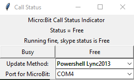

# MicrobitStatusIndicator
Use one or more Micro:Bit controllers (<https://microbit.org/>) to provide a visual indicator of your "free/busy" status.

Code is currently a "rough draft", but functional enough for basic use.

I would also welcome other contributors to this project - even if it's just filing issues :-)

## Programming your MicroBit

Plug in your microbit and copy the `microbit-StatusIndicator.hex` file to the microbit.

Alternatively, you can use the MakeCode editor to download a .hex file (of the code in the link) and put it on your microbit: https://makecode.microbit.org/_RaALAaEPtPK4

This program listens on the USB serial port and the radio. If it receives a message on the serial port it forwards it
to the radio, so you can have multiple MicroBits displaying the same status as long as one of them is plugged into
your computer to get updates.

Holding the "A" button will display the signal strength across the bottom row of LEDs from the last received message

Holding the "B" button on the serial-connected MicroBit will display the number of "radio messages received" from MicroBits listening over the radio link.

More details on the implementation of the code running on the Microbit: [microbit_details.md](docs/microbit_details.md)

## Running the Python status update script

Currently you'll need to do `python -m pip install pyserial` to pick up the serial module.

Generally, just run it and it launches a small window:

When the `Update Method` is set to `Manual` mode, the `Busy` and `Free` buttons control the display on the MicroBits.
When another update method is selected, the script polls on that method every 30 seconds and makes an update.

The serial port ("COM") is selectable as well. It defaults to the highest COM port because that is what works best on my system.

To use the `Powershell Lync2013` method to automatically set the status if you are on a call using Lync 2013, Lync 2016 or Skype for Business, you will need to follow these extra instructions as described on these web pages:

* https://blog.jongallant.com/2016/08/solution-lync-2013-not-found/
* https://stackoverflow.com/questions/56286156/lync-model-reference-for-skype-for-business-2016-online-status?noredirect=1&lq=1

