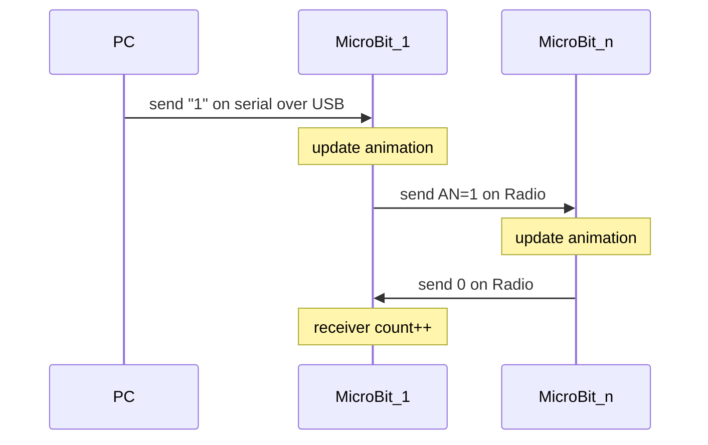

# The Micro:Bit side of things:

## Detailed install

To be written...

## Code details

### Communication flow

A simplified version of the communication flow for updating the animation choice is below. The code supports an arbitrary number of MicroBits connected via radio as "MicroBit_n"

[](https://mermaid-js.github.io/mermaid-live-editor/#/edit/eyJjb2RlIjoic2VxdWVuY2VEaWFncmFtXG5cdFBDLT4-TWljcm9CaXRfMTogc2VuZCBcIjFcIiBvbiBzZXJpYWwgb3ZlciBVU0JcbiAgTm90ZSBvdmVyIE1pY3JvQml0XzE6IHVwZGF0ZSBhbmltYXRpb25cbiAgTWljcm9CaXRfMS0-Pk1pY3JvQml0X246IHNlbmQgQU49MSBvbiBSYWRpb1xuICBOb3RlIG92ZXIgTWljcm9CaXRfbjogdXBkYXRlIGFuaW1hdGlvblxuICBNaWNyb0JpdF9uLT4-TWljcm9CaXRfMTogc2VuZCAwIG9uIFJhZGlvXG4gIE5vdGUgb3ZlciBNaWNyb0JpdF8xOiByZWNlaXZlciBjb3VudCsrXG5cblxuXHRcdFx0XHRcdCIsIm1lcm1haWQiOnsidGhlbWUiOiJkZWZhdWx0In0sInVwZGF0ZUVkaXRvciI6ZmFsc2V9)
<!---

--->

### Animation requirements

The "busy" and "free" are intended built as short animations to meet the following requirements:

* Don't be too distracting
* Animate slightly so we can tell the code is running and not frozen
* Be visible from from 8 meters away
* Look correct even if MicroBit is oriented "upside down" or rotated 90 degrees for easier placement in the environment.

### Additional animations

Currently only 2 animations are in the current implementation a lightly pulsing "X" and a rotating circle.

More animations could easily be added and associated to different numbers. Supporting more than 10 animations would require recoding the
parsing algorithms to look at more than one character in the command string from the serial port.

